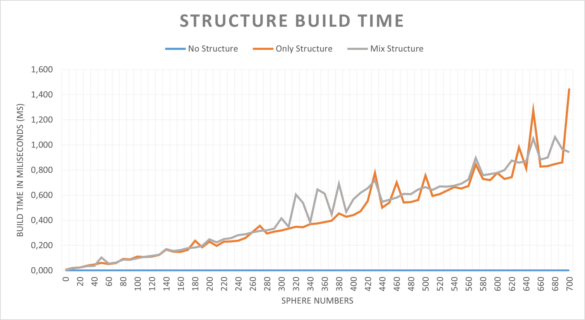
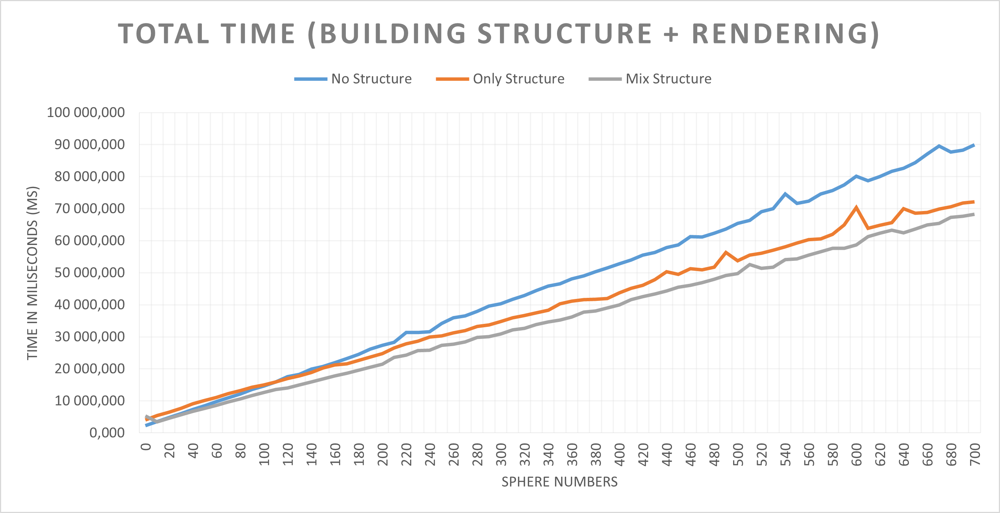

# Raytracer

This project is a small raytracer in C++ developed with CMake on Visual Studio.
The source code is located in the **Raytracer** folder

### It features :

- An acceleration structure : Bounding Volume Hierarchy or BVH (explained below)
- Orthographic and Perspective cameras
- Multiple point light sources with intensity and albedo
- Simple shadows
- Diffuse & Reflective surfaces
- Antialiasing (super sampling)
- An abstract class representing objects in the scene
- A random seed to initialize the pseudorandom number generator

### List of dependencies : 

- SFML and GLM (see file **Setup.md**)

### What can be implemented later :

- Soft shadows with surface light
- Improving the acceleration structure
- 3D models
- Refraction surface

In this raytracer we can define multiple variables modifying the execution time and the result :

- Width & height (obviously)
- The number of ray cast for a single pixel (for the antialiasing)
- The maximum depth of the refraction rays
- The Orthographic focal distance
- And many more !

## Last result :

1000 x 1000 image, 8 ray per pixel, reflection depth to 3, 3 point light.

# Acceleration Structure : BVH (Bounding Volume Hierarchy)

### What is the BVH ?

The Bounding Volume Hierarchy is an acceleration structure primarily used in raytracing. It split the structure in multiple Axis-Aligned Bounding-Box (or AABB) which increase the performance of the program by reducing time to find the closest intersection. An AABB can be represented as a 3D rectangle.

It is represented as a **nearly (or almost) complete binary tree** (see https://en.wikipedia.org/wiki/Binary_tree). It means, each level of the binary tree is full (each node has 2 children), except for the last level where all nodes (leaf then) are as far as left as possible.

### Why choosing the BVH ?

I choose the BVH because it enables the program to compute less intersections for each ray. Plus, a part of the intersections are computed from AABBs, resulting in faster intersections.

### How is it built ?

Each node is created recursively from a list of objects in the scene as an argument, meaning the root takes the entire list of objects from the scene. From the list, we compute the AABB containing all the objects in the list and store that AABB in the node itself. Then we sort and split the list into 2 sub-list from which we create 2 children.

The purpose to sort and split the list is to have 2 children that are separated in space, giving us the best performance. (Note : it doesn't mean the 2 children doesn't overlap each other)

There is multiple ways to sort the list. I chose to sort on the longest AABB's axis. This result in AABBs being as close to a square shape as they can be.

### Limits

While testing the BVH structure I discovered that the 5 borders of the scene, which are incredibly big spheres, can be intersected from any ray in the scene. So I took them out of the BVH and for each ray I am checking if they are intersected before the BVH result.

## Benchmarking the BVH

### Variables

Before benchmarking, I have to define which variables I will use and which variables will be set to an invariant value.

Obviously, the number of object in the scene is the only important variable, because for each run I want the same : width (set to 1000), height (set to 1000), antialiasing (set to 8 ray per pixel), reflection depth (set to 3 consecutive ray), same camera (perspective).

### Batch file

To make life easier, I decided to create a very simple batch file to execute the program sequentially.
This batch write the performance results in text files, and the each image computed is saved so I could observe problems, if any.

### Method

In addition to the execution time of the raytracer (both BVH structure building time & rendering time), I counted the number of ray, the number of AABB intersection and the number of objects intersections for each program execution. All of that 3 times : One without the BVH, one only with the BVH, and the last one with the BVH structure for every objects except the 5 background large sphere.

I launched the raytracer with 0 to 700 (incremented by 10) pseudo random generated spheres, 3 times. I do not count the 5 background sphere, nor the 3 reflective spheres as pseudo random generated spheres.

### Results

The first data that we want to consider is the time the structure takes to be built, hoping it is not exponential.

In the first graph, we can clearly see that the building time is linear, ensuring the program runs on any scene objects number and does not explode. And, as obvious as it can get, it takes no time to build the structure in the "No Structure" case.

Now, we want to verify if the structure saves us time.

This graph proves the BVH improve performance. And the "Mix Structure" case is even better (Remember that the mix structure is a BVH where the 5 background spheres are not in the structure, but computed as the "No Structure" case do).

For 700 spheres, the "Mix Structure" case saves us around 20 seconds. 

The last graph confirm the gain : We tend to render more than 20% faster with the BVH than without the BVH.

And lastly, in the "Only Structure" case, the building time take 0,097% of the execution time. And on the "Mix Structure case", it takes 0,117%. In both cases, it is  an insignificant but useful process which saves us more than 20% of the execution time.

