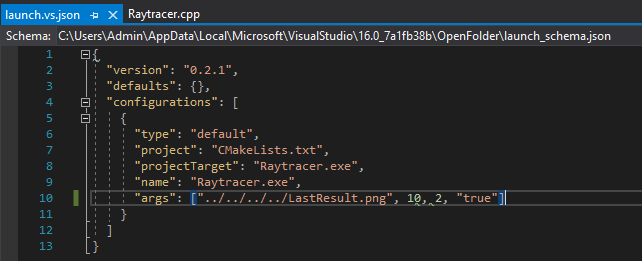

[TOC]


# How to setup SFML & GLM in a CMake project on Visual Studio (yes that's specific)

First of all, you need to download each library. They are NOT included in this GitHub repository.

## Dowloading GLM

Either you download or clone the git repository https://github.com/g-truc/glm
Or you download the latest version from their website https://glm.g-truc.net/0.9.9/index.html (Tab Downloads or under the logo)

I personally downloaded the git repository.

Then, copy EVERY file under a new directory. I didn't tried it, but you can put this directory inside the project. I left it outside in order to be used by multiple project. Let's name it *librairies*.

See **Setting up librairies** to include GLM inside your CMake project.


## Dowloading SFML

Go to the page https://github.com/SFML/SFML/releases/tag/2.5.1
Scroll down and you'll see an open folder called "Assets". Inside it you'll find multiple SFML versions. You have the choice to build yourself the libraries with the source code. Or you can simply download the desired version. I choosed **SFML-2.5.1-windows-vc15-64-bit.zip**.

Unzip the folder and copy it a directory (preferably the same one as GLM). You ONLY need folders *lib* and *include*.


## Creating the CMake project

Launch Visual Studio.

Create a new project and select the CMake type. Name it as you please.

If you have difficulties, I suggest to look at Microsoft's documentation : https://docs.microsoft.com/en-us/cpp/build/cmake-projects-in-visual-studio?view=vs-2019


## Setting up libraries

Open **CMakeLists.txt** located inside the solution explorer.

### For GLM :

```cmake
cmake_minimum_required (VERSION 3.8)

project ("Synthese_TP2")

# Current directory is Synthese_TP2
# Set path
set(glm_DIR <PATH-TO-GLM-LIBRARY>/cmake/glm)
find_package( glm REQUIRED )

# Executable source, CPP and HPP files in your project
add_executable (Synthese_TP2 "Synthese_TP2.cpp" "Synthese_TP2.h")

# Add target libraries
target_link_libraries(${PROJECT_NAME} glm::glm)
```


### For SFML

```cmake
cmake_minimum_required (VERSION 3.8)

project ("Synthese_TP2")

# Current directory is Synthese_TP1
# Set SMFL static
set(SFML_STATIC_LIBRARIES TRUE)
# Set SMFL path
set(SFML_DIR <PATH-TO-SFML-LIBRARY>/cmake/SFML)
# Add required packages. Here is included graphics and window only
find_package(SFML 2.5.1 COMPONENTS graphics window REQUIRED)

# Executable source, CPP and HPP files in your project
add_executable (Synthese_TP2 "Synthese_TP2.cpp" "Synthese_TP2.h")

# Add target libraries
target_link_libraries(${PROJECT_NAME} sfml-graphics sfml-window)
```


## At the end it should look something like this :

```cmake
# CMakeList.txt : projet CMake pour Synthese_TP2, incluez la source et définissez
# la logique spécifique au projet ici.
#
cmake_minimum_required (VERSION 3.8)

project ("Synthese_TP2")

# Current directory is Synthese_TP1
set(glm_DIR ../../libraries/glm-master/glm-master/cmake/glm)
find_package( glm REQUIRED )

set(SFML_STATIC_LIBRARIES TRUE)
set(SFML_DIR ../../libraries/SFML/lib/cmake/SFML)
find_package(SFML 2.5.1 COMPONENTS graphics window REQUIRED)

# Ajoutez une source à l'exécutable de ce projet.
add_executable (Synthese_TP2 "Synthese_TP2.cpp" "Synthese_TP2.h")

target_link_libraries(${PROJECT_NAME} glm::glm)
target_link_libraries(${PROJECT_NAME} sfml-graphics sfml-window)

# TODO: Ajoutez des tests et installez des cibles si nécessaire.
```


## Include the libraries in the source code

### GLM

```c++
#include "glm/glm.hpp"
```

### SFML

```c++
#include "SFML/Graphics.hpp"
```

# Using arguments to main with CMake in Visual Studio

First, you need to set the current target to your executable file : 


(It doesn't matter if it is Release or Debug)

Then click on *Debug > Debug and Launch Settings for XXXX* (In my example, XXXX will be replaced by Raytracer). It will open a new file : **launch.vs.json** where you can set your arguments :



The arguments are represented as a list on the "args" line.

And now you can launch (& debug) your project ! 

# FAQ

If you have questions ask me directly !